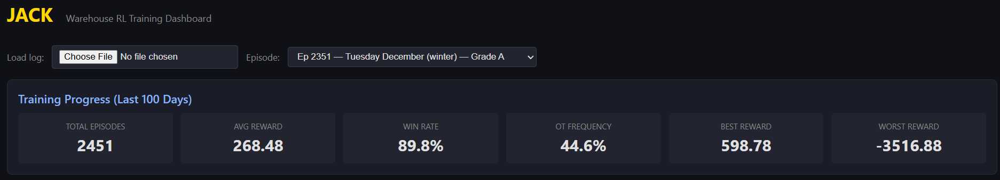
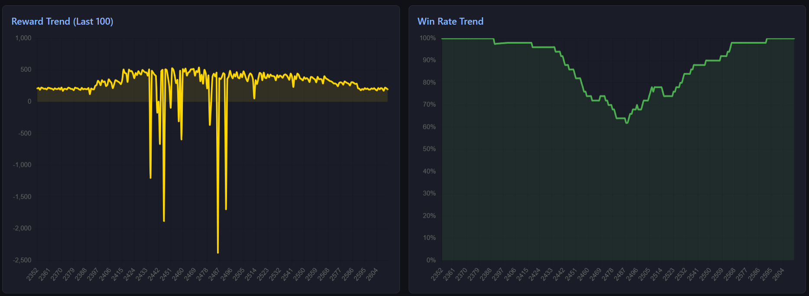
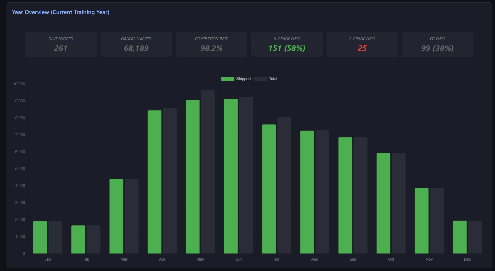
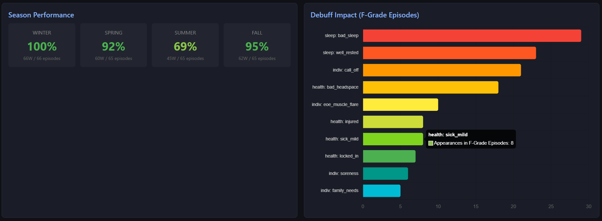
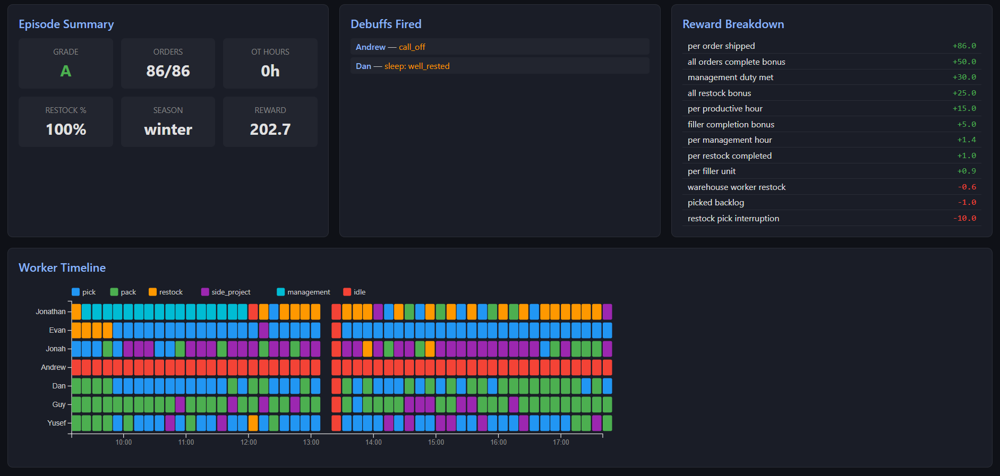
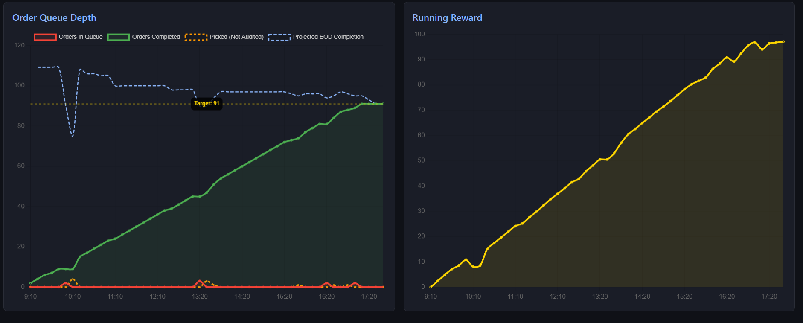
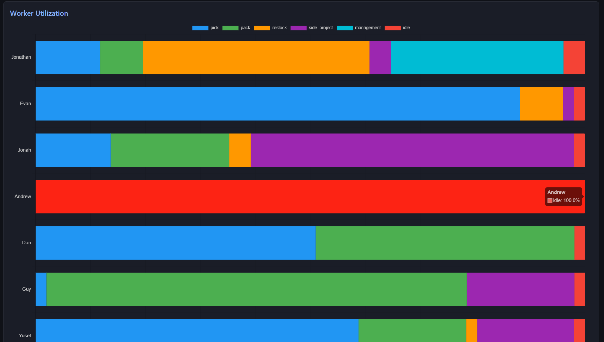

# Jack

PPO + LSTM agent for multi-week warehouse scheduling. Trained on a full simulated work year — 261 days, 7 workers, 15-minute decision intervals.

Built on top of [Dolly](https://github.com/jarmstrong158/Dolly). Dolly handles single-day optimization. Jack adds weekly scope: hustle pacing, worker exhaustion, seasonal demand, and consequence chains that carry across days.

---

## Simulation

7 workers. 6 tasks. Every 15 minutes, Jack assigns each worker a task and decides whether to push them into hustle.

Demand is seasonal — order volume ranges from ~60/day in January to ~500/day at peak. Each worker arrives with a probabilistic debuff profile: sleep quality, health status, injury risk, no-call probability. On top of that, the simulation enforces per-worker physical constraints, role requirements, and scheduling rules that further restrict what each person can do on any given day.

Jack learns to optimize across all of it simultaneously — not just routing the day, but managing the week.

---

## Results

~2,450 training days (~9.4 simulated years).

**Training history** shows cumulative learning signal and win rate over time — the primary indicator of whether the policy is improving, plateauing, or regressing across episodes.



**Reward and win rate trends** expose how the policy holds up under pressure. A stable upward trend means the agent is generalizing. Dips map directly to seasonal difficulty — useful for identifying where the model needs more reps.



---

## Year Overview

**The year overview** is the top-level accountability view — full order throughput, completion rate, and grade distribution across all 261 work days. It answers whether the agent is running a competent operation across an entire year, not just cherry-picked days.



| Stat | Value |
|------|-------|
| Days logged | 261 |
| Orders shipped | 68,189 |
| Completion rate | 98.2% |
| A-grade days | 151 (58%) |
| F-grade days | 25 |
| OT days | 99 (38%) |

---

## Season Breakdown

**Season performance** isolates where the policy is strong and where it breaks down. Separating by season makes it possible to see whether failures are random or concentrated — and whether the agent is learning to handle the conditions that cause them.



| Season | Win Rate |
|--------|----------|
| Winter | 100% |
| Spring | 92% |
| Summer | 69% |
| Fall | 95% |

The debuff impact chart on the right identifies which real-world workforce conditions are most correlated with failure days — giving a direct line of sight into what the agent still needs to solve.

---

## Episode Detail

**Per-episode breakdown** surfaces every factor that influenced a given day: debuffs active, tasks assigned, reward components earned or lost. This is where you trace why a day went well or went sideways.



The worker timeline underneath shows the full task sequence for every worker across the shift — the actual decisions the agent made, visible at 15-minute resolution.

---

## Order Flow

**Intra-day order flow** tracks queue depth and completion pace in real time against the projected EOD target. It shows whether the agent is staying ahead of demand, falling behind, or recovering after disruption — and at what point in the day that happens.



---

## Worker Utilization

**Worker utilization** shows how each person's productive hours were distributed across tasks for the day. Idle time, task concentration, and role balance are all visible here — useful for validating that the agent is deploying the team efficiently rather than over-relying on a subset of workers.



---

## Architecture

```
state (155-dim) → Linear → ReLU → LSTM(256) → 7 policy heads + 1 value head
```

- **State:** 19 features per worker × 7 workers + 7 year-level features
- **Action space:** 7 workers × 12 actions (6 tasks × hustle on/off)
- **Training:** PPO with TBPTT, chunk size 16. Updates at end of each day.
- **Hidden state:** persists across all ~13,000 steps in a year, reset at year start

Action masking enforces hard constraints at every step — absent workers, shift end, hustle exhaustion, pack-only restrictions.

---

## Hustle System

Per-worker daily hustle caps. Exceed 2× the cap in a week: -15% OPH, hustle locked for the remainder. Management and idle cannot be hustled.

| Worker | Daily Cap | Exhaustion Threshold |
|--------|-----------|----------------------|
| Marcus | 9.5h | 19h |
| Nolan | 7.0h | 14h |
| Felix | 6.0h | 12h |
| Blake | 8.0h | 16h |
| Reid | 8.0h | 16h |
| Trent | 3.0h | 6h |
| Omar | 7.0h | 14h |

---

## Worker Roster

| Name | Base OPH | Shift | Role |
|------|----------|-------|------|
| Marcus | 17.00 | 9.75h | Manager |
| Nolan | 15.35 | 8.5h | Assistant Manager |
| Felix | 16.23 | 8.5h | Warehouse |
| Blake | 18.30 | 8.5h | Warehouse |
| Reid | 18.94 | 8.5h | Warehouse |
| Trent | 15.28 | 8.5h | Warehouse |
| Omar | 14.88 | 8.5h | Warehouse |

Picker rotation: Mon=Reid, Tue=Blake, Wed=Felix, Thu=Omar, Fri=Trent

---

## Grading

| Grade | Criteria |
|-------|----------|
| A | All orders shipped, restock complete, management met, no OT |
| B | All orders shipped with OT, or minor restock/management miss |
| C | 95%+ completion |
| D | 85–94% completion |
| F | Under 85% or hard stop with open orders |

---

## Dashboard

```bash
python -m http.server 8080
```

`http://localhost:8080/volt_sim/dashboard/dashboard.html`

Load `volt_sim/data/episode_log.json`. Updates at year end.

---

## Usage

```bash
# Train from scratch
python volt_sim/train.py

# Resume
python volt_sim/train.py --resume
```

**Requirements:** Python 3.10+, PyTorch, NumPy

```bash
pip install torch numpy
```

---

## Structure

```
volt_sim/
  agent/
    ppo.py                  # PPO + LSTM actor-critic, TBPTT
    actions.py              # Action encoding, masking
    state.py                # Running stats normalization
  env/
    warehouse_env.py        # Core simulation
    year_env.py             # Year wrapper, weekly hustle tracking
    workers.py              # Worker state, OPH, debuffs, hustle
    episode_generator.py    # Daily scenario generation
  sim_logging/
    episode_logger.py
  dashboard/
    dashboard.html
  config.py
  train.py
```
